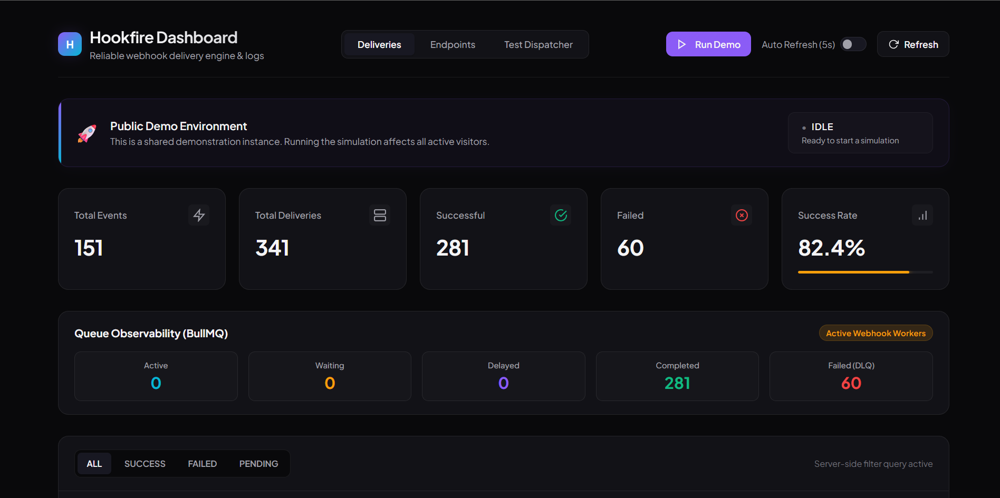
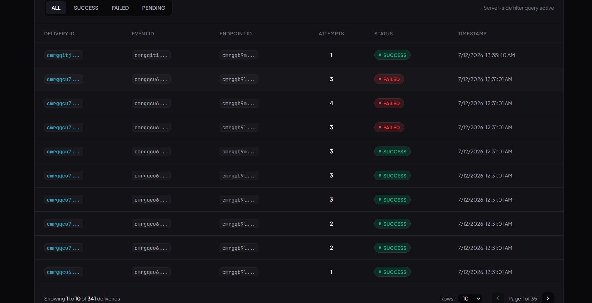
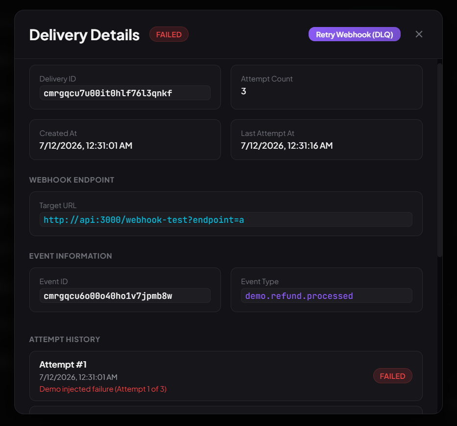
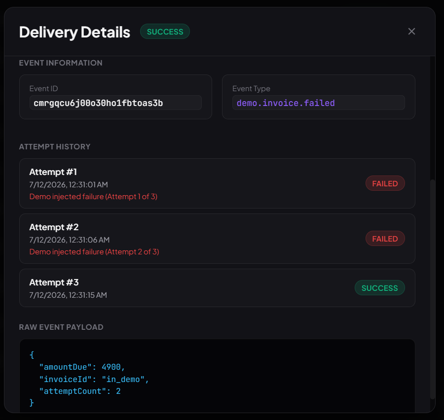
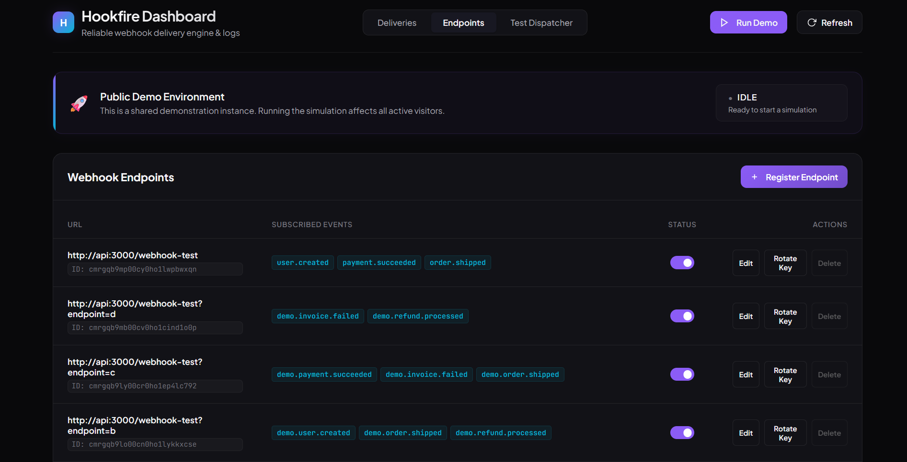
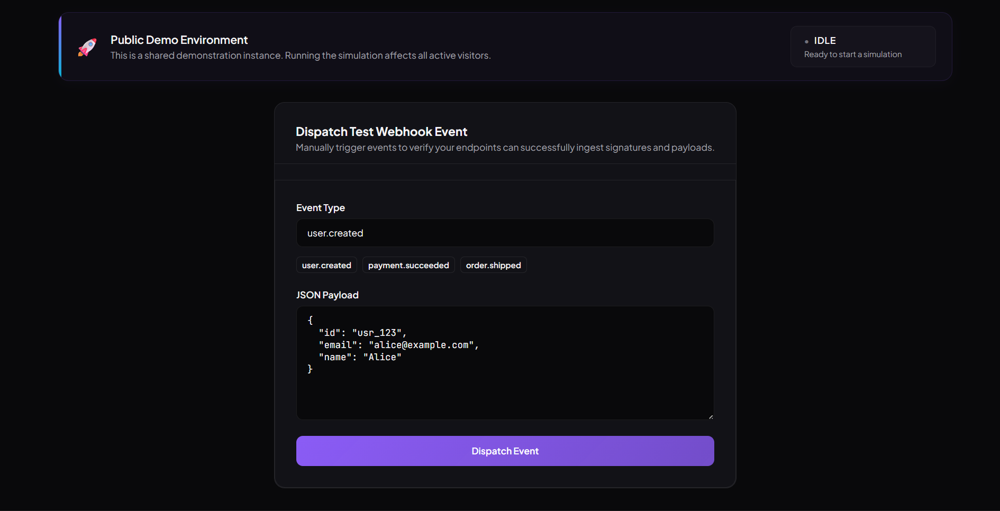

# Hookfire 🔥

Hookfire is a decoupled, event-driven webhook delivery engine designed for low-latency ingestion and reliable, asynchronous background delivery.

## 📖 About Hookfire

Traditional web systems often handle webhook dispatches inline, which bottlenecks client response times and couples third-party reliability directly to your main database transactions. Hookfire solves this by decoupling event ingestion from delivery. When an event is ingested via a simple POST request, it is parsed, saved, and instantly queued. Workers resolve subscriptions in parallel and execute dispatches using BullMQ''s robust retrying capabilities.

## 🚀 Key Features

- **Two-Stage Fan-Out**: Isolates API ingestion from subscriber resolution, preventing endpoint bottlenecks.
- **Reliability & DLQ**: At-least-once delivery with exponential backoff and manual retries from the dashboard.
- **Cryptographic Security**: AES-256-GCM encryption-at-rest for secrets and HMAC-SHA256 request signatures.
- **Rate Limiting**: Multi-tiered Redis sliding-window rate limiters with fail-open safety.
- **Dockerized Stack**: Complete production-ready multi-container configuration (Nginx, API, Workers, PG, Redis).

## 📂 Documentation Quick Links

- **[System Design Blueprint (ARCHITECTURE.md)](ARCHITECTURE.md)**: Deep dive into the data model, security protocols, and state transitions.
- **[Deployment Guide (DEPLOYMENT.md)](DEPLOYMENT.md)**: Standard operating procedures for deploying on AWS EC2 with Docker Compose and Nginx.
- **[Project Checklist (PROJECT_CHECKLIST.md)](PROJECT_CHECKLIST.md)**: Comprehensive verification checklist of all backend and frontend capabilities.

## 🛠️ Quick Start (Development)

### Prerequisites

- Node.js v20+ (for bare-metal execution)
- Docker and Docker Compose (recommended)

### 1. Setup Environment

Clone the repository and copy the environment template:

```bash
cp .env.example .env
```

### 2. Start Services

Build and start the multi-container development environment in detached mode:

```bash
docker compose -f docker-compose.dev.yml up -d --build
```

### 3. Database Setup

Execute the Prisma schema migration to initialize the PostgreSQL database:

```bash
docker compose -f docker-compose.dev.yml exec api npx prisma db push
```

### 4. Service Topology & Ports

| Service         | Port (Dev)  | Port (Prod) | Access Scope            |
| :-------------- | :---------- | :---------- | :---------------------- |
| React Dashboard | `5173:5173` | `80:80`     | Publicly exposed        |
| Express API     | `3000:3000` | internal    | Proxied through Nginx   |
| PostgreSQL      | `5432:5432` | internal    | Docker internal network |
| Redis Cache     | `6379:6379` | internal    | Docker internal network |

The React dashboard is available at [http://localhost:5173](http://localhost:5173) and the API at [http://localhost:3000](http://localhost:3000).

---

## 📺 Dashboard Showcase

Here is a visual overview of the Hookfire React Dashboard, which provides live metrics, delivery logs, endpoint management, and automated demo simulations.

<table>
  <tr>
    <td width="50%" align="center">
      
      <br />
      <sub><b>Figure 1:</b> High-level metrics tracking overall webhook dispatch success rate and queue status.</sub>
    </td>
    <td width="50%" align="center">
      
      <br />
      <sub><b>Figure 2:</b> Comprehensive delivery logs tracking attempt counts, HTTP response statuses, and errors.</sub>
    </td>
  </tr>
  <tr>
    <td width="50%" align="center">
      
      <br />
      <sub><b>Figure 3:</b> Detailed view of a specific Failed delivery and its attempt logs.</sub>
    </td>
    <td width="50%" align="center">
      
      <br />
      <sub><b>Figure 4:</b> Detailed view of a specific Successful delivery and its attempt logs.</sub>
    </td>
  </tr>
  <tr>
    <td width="50%" align="center">
      
      <br />
      <sub><b>Figure 5:</b> Webhook endpoint registry showing endpoint statuses, URL configurations, and signing secrets.</sub>
    </td>
    <td width="50%" align="center">
      
      <br />
      <sub><b>Figure 6:</b> Dispatch test webhook event tab.</sub>
    </td>
  </tr>
</table>
